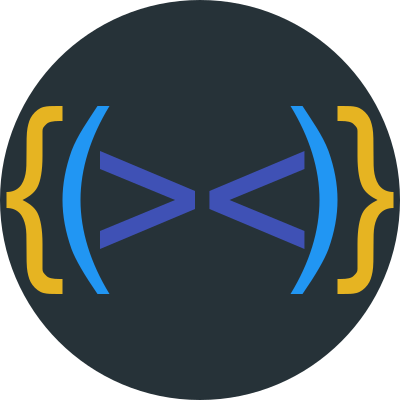
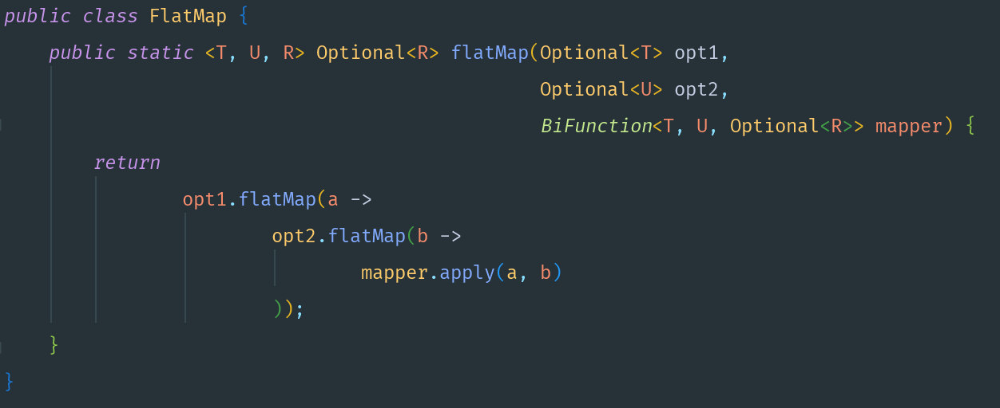
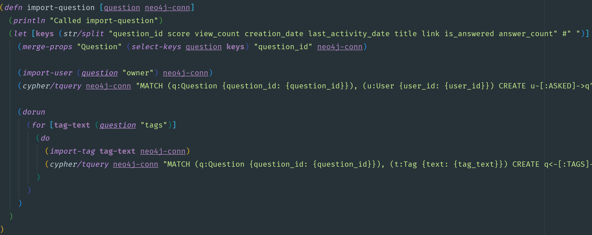
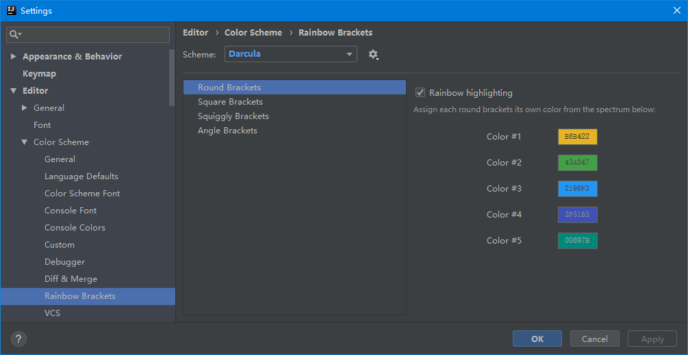

<div align="center">
    <a href="https://plugins.jetbrains.com/plugin/10080-rainbow-brackets">
        
    </a>
</div>
<h1 align="center">Intellij rainbow brackets</h1>
<p align="center">🌈Rainbow Brackets for IntelliJ based IDEs/Android Studio/HUAWEI DevEco Studio.</p>

<p align="center"> 
<a href="https://actions-badge.atrox.dev/izhangzhihao/intellij-rainbow-brackets/goto?ref=2020.2"></a>
<a href="https://github.com/izhangzhihao/intellij-rainbow-brackets/releases"></a>
<a href="https://plugins.jetbrains.com/plugin/10080-rainbow-brackets"></a>
<a href="https://plugins.jetbrains.com/embeddable/install/10080"></a>
<a href="https://plugins.jetbrains.com/plugin/10080-rainbow-brackets"></a>
<a href="https://opencollective.com/intellij-rainbow-brackets#backer"></a>
<a href="https://opencollective.com/intellij-rainbow-brackets#sponsor"></a>
</p>

<br>

- [Compatibility](#compatibility)
- [Supported languages](#supported-languages)
- [Author's choice](#authors-choice)
- [Sponsored By](#sponsored-by)
- [Install](#install)
- [Screenshots](#screenshots)
- [Customize colors](#customize-colors)
- [Use color generator](#use-color-generator)
- [Config file path](#config-file-path)
- [HTML code in js](#html-code-in-js)
- [Kotlin function literal braces and arrow](#kotlin-function-literal-braces-and-arrow)
- [Disable rainbow brackets for specific languages](#disable-rainbow-brackets-for-specific-languages)
- [Contribute](#contribute)
- [Support Us](#support-us)
- [Backers](#backers)
- [Sponsors](#sponsors)
- [Acknowledgements](#acknowledgements)

## Compatibility

IntelliJ IDEA, PhpStorm, WebStorm, PyCharm, RubyMine, AppCode, CLion, Gogland, DataGrip, Rider, MPS, Android Studio, HUAWEI DevEco Studio

## Supported languages

Java, Scala, Clojure, Kotlin, Python, Haskell, Agda, Rust, JavaScript, TypeScript, Erlang, Go, Groovy, Ruby, Elixir, ObjectiveC, PHP, HTML, XML, SQL, Apex language, C#, Dart, Pug/Jade, Bash, Vue.js, C# Razor Pages, GLSL(the OpenGL Shading Language), Go Template, C++, C...

## Author's choice

Rainbow Brackets + Material Theme UI(Oceanic theme) + Nyan Progress Bar + [Fira Code](https://github.com/tonsky/FiraCode) (Font)

## Sponsored By

This plugin is being sponsored by [Codota](https://www.codota.com/?utm_source=jbmarket&utm_campaign=jbrainbowbrackets&utm_medium=banner) and [CodeStream](https://sponsorlink.codestream.com/?utm_source=jbmarket&utm_campaign=jbrainbowbrackets&utm_medium=banner).

<a href="https://www.codota.com/?utm_source=jbmarket&utm_campaign=jbrainbowbrackets&utm_medium=banner">
    
</a>

Code faster and smarter using code completions learned from millions of programs directly in IntelliJ, Android Studio or Eclipse. [Get Codota](https://www.codota.com/?utm_source=jbmarket&utm_campaign=jbrainbowbrackets&utm_medium=banner)

[](https://sponsorlink.codestream.com/?utm_source=jbmarket&utm_campaign=jbrainbowbrackets&utm_medium=banner)

Eliminate context switching and costly distractions. Create and merge PRs and perform code reviews from inside your IDE while using jump-to-definition, your keybindings, and other IDE favorites. [Learn more](https://sponsorlink.codestream.com/?utm_source=jbmarket&utm_campaign=jbrainbowbrackets&utm_medium=banner)!

Development powered by [JetBrains](https://www.jetbrains.com/?from=IntelliJRainbowBrackets).

[](https://www.jetbrains.com/?from=IntelliJRainbowBrackets)

Whichever technologies you use, there's a JetBrains tool to match.

## Install

<a href="https://plugins.jetbrains.com/embeddable/install/10080">
    
</a>

Or you could install it inside your IDE:

For Windows & Linux - <kbd>File</kbd> > <kbd>Settings</kbd> > <kbd>Plugins</kbd> > <kbd>Marketplace</kbd> > <kbd>Search for "Rainbow Brackets"</kbd> > <kbd>Install Plugin</kbd> > <kbd>Restart IntelliJ IDEA</kbd>

For Mac - <kbd>IntelliJ IDEA</kbd> > <kbd>Preferences</kbd> > <kbd>Plugins</kbd> > <kbd>Marketplace</kbd> > <kbd>Search for "Rainbow Brackets"</kbd> > <kbd>Install Plugin</kbd>  > <kbd>Restart IntelliJ IDEA</kbd>

### Install snapshot build

You can download the latest snapshot build from [here](https://github.com/izhangzhihao/intellij-rainbow-brackets/actions/workflows/build.yml?query=workflow%3ABuild), just click the latest build and click the 'Artifacts' tab.(You need logged in via github) After the snapshot build downloaded, unzip it(via `unzip UnZipMe.zip`), and install the zip file(intellij-rainbow-brackets.zip[]()) by `Install Plugin from Disk...`.

## Screenshots

* Java




* Scala


* Clojure



* Kotlin


* HTML/XML


* Scope highlighting

**The highlight effects will not remove after release the shortcuts, but press `ESC` key can do this. You could also config `Press any key to remove the highlighting effect` in setting page.**

<kbd>Ctrl + Button3</kbd>(Windows & Linux) or <kbd>Meta+ Button3</kbd>(Mac):

NOTE: <kbd>Button3</kbd> means "Secondary Click (click or tap with two fingers)" on Mac os, "Right click" for Windows or Linux.


<kbd>Alt + Button3</kbd>:

NOTE: <kbd>Button3</kbd> means "Secondary Click (click or tap with two fingers)" on Mac os, "Right click" for Windows or Linux.


* Rainbow indent guide lines


* looking forward to your screenshots(PR welcome!)

## Customize colors

<kbd>Settings/Preferences</kbd> > <kbd>Editor</kbd> > <kbd>Color Scheme</kbd> > <kbd>Rainbow Brackets</kbd>:



## Use color generator

If you didn't like the build-in colors, or want some new color but don't want to try out and pick colors. Please use color generator.

<kbd>Settings/Preferences</kbd> > <kbd>Other Settings</kbd> > <kbd>Rainbow Brackets</kbd> > <kbd>Use color generator</kbd>

If you turn on this option, we will auto generate some colors for you.

### Advanced options of color generator

If you need more control, you can decide the options of color generator by edit [the config file](#config-file-path), 

The value of the option `customColorGeneratorOption` is a json object, available options are:

```hue``` – Controls the hue of the generated color. You can pass a string representing a color name: ```red```, ```orange```, ```yellow```, ```green```, ```blue```, ```purple```, ```pink``` and ```monochrome``` are currently supported. If you pass a  hexidecimal color string such as ```#00FFFF```, color generator will extract its hue value and use that to generate colors.

```luminosity``` – Controls the luminosity of the generated color. You can specify a string containing ```bright```, ```light``` or ```dark```.

Please make sure the value of the option `customColorGeneratorOption` is escaped in xml format,
you can use [this tool](https://www.freeformatter.com/xml-escape.html#ad-output) to do this. Please don't forget to restart your IDE after change the config file.

```xml
<application>
  <component name="RainbowSettings">
    <option name="useColorGenerator" value="true" />
    <option name="customColorGeneratorOption" value="{&quot;luminosity&quot;: &quot;light&quot;,&quot;hue&quot;: &quot;blue&quot;}"/>
  </component>
</application>
```

### Want to config the number of colors?

<kbd>Settings/Preferences</kbd> > <kbd>Other Settings</kbd> > <kbd>Rainbow Brackets</kbd> > `Number of colors`: 5 or more

And you can use the color generator and config you number of colors at the same time.

NOTE: For default and darcula color scheme(`Editor -> Color Scheme -> Rainbow Brackets -> Scheme`) the color number is 10, for the other scheme the number is 5, if your number is bigger than the number, you can config them in the config file.
If the color is not exist, we will use color generator to generator it for you.

Please follow [the official guide](https://www.jetbrains.com/help/idea/configuring-colors-and-fonts.html#share-color-scheme):
* `Export a color scheme as XML`
* Edit the xml file, put `ROUND_BRACKETS_RAINBOW_COLOR5` to `ROUND_BRACKETS_RAINBOW_COLOR100` to match your number just like [the default color scheme](./src/main/resources/colorSchemes/rainbow-color-default-darcula.xml).
* `Import a color scheme`

## Config file path

If you want to customize the advanced configuration, you could edit the config file then restart your IDE. 
Config file path in `APP_CONFIG/rainbow_brackets.xml`. 

In MAC OS env maybe like `~/Library/Preferences/IntelliJIdea2020.2/options/rainbow_brackets.xml`.

If you are using the ToolBox, then it will be like `~/Library/ApplicationSupport/JetBrains/IntelliJIdea2020.2/options/rainbow_brackets.xml`

In Linux env maybe like `~/.IntelliJIdea/config/options/rainbow_brackets.xml`.

In Windows env maybe like `C:\Users\izhangzhihao\.IntelliJIdea2020.2\config\options\rainbow_brackets.xml`.

## HTML code in js

To enable rainbow brackets for HTML inside js code like this:

```javascript
var html = '<div><div><div>Hello</div></div></div>';
```

This plugin will automatically override color scheme property "HTML_CODE" [cause our rainbow color been covered by intellij built-in functionality](https://intellij-support.jetbrains.com/hc/en-us/community/posts/360000117450-My-HighlightVisitor-been-covered-by-intellij-built-in-functionality).
You still could set `<option name="rainbowifyHTMLInsideJS" value="false" />` in config file to disable just like [Config brackets colors](#config-brackets-colors).

## Kotlin function literal braces and arrow

To enable rainbow brackets for multiple level lambda Kotlin code like this:

```kotlin
event.throwable?.let { throwable ->
    IdeErrorsDialog.findPluginId(throwable)?.let { pluginId ->
        PluginManager.getPlugin(pluginId)?.let { ideaPluginDescriptor ->
            if (!ideaPluginDescriptor.isBundled) {
                bean.pluginName = ideaPluginDescriptor.name
                bean.pluginVersion = ideaPluginDescriptor.version
            }
        }
    }
}
```

This plugin will automatically override color scheme property "KOTLIN_FUNCTION_LITERAL_BRACES_AND_ARROW" cause our rainbow color is being covered by kotlin plugin built-in functionality.
You still could set `<option name="rainbowifyKotlinFunctionLiteralBracesAndArrow" value="false" />` in config file to disable just like [Config brackets colors](#config-brackets-colors).

## Disable rainbow brackets for specific languages

<kbd>Settings/Preferences</kbd> > <kbd>Other Settings</kbd> > <kbd>Rainbow Brackets</kbd> > `Do NOT rainbowify these languages (name or extension, comma separated)`: 

NOTE: You can use **name** of language or **extension** of file name(The names should be **lowercase**).

## Contribute

NOTE: To view the PSI tree and explore the internal PSI structure of source code, you need to set up your IDE by following [this](https://www.jetbrains.com/help/idea/psi-viewer.html).
For the Rider IDE, please follow: [this](https://rider-support.jetbrains.com/hc/en-us/articles/207327910-How-to-run-JetBrains-Rider-in-Internal-Mode)

For small changes, [Gitpod](https://gitpod.io/#https://github.com/izhangzhihao/intellij-rainbow-brackets) is recommended. [](https://gitpod.io/#https://github.com/izhangzhihao/intellij-rainbow-brackets)

* `gradle test`
* `gradle runIde`
* `gradle buildPlugin`

## Support Us

You can support us by the following actions:

* Star this project
* Share this plugin with your friends
* Rate this plugin on [JetBrains plugin repository](https://plugins.jetbrains.com/plugin/10080-rainbow-brackets)
* Make pull requests
* Report bugs
* Tell us your ideas
* Become a sponsor by donating on [Open Collective](https://opencollective.com/intellij-rainbow-brackets)
* Become a sponsor by donating with AliPay or WeChatPay
* Don't want to use AliPay's mobile App? If you could read Chinese, please use [the official website](https://shenghuo.alipay.com/send/payment/fill.htm) to transfer your donation to my Alipay account(izhangzhihao@hotmail.com). Otherwise, you can try [the English version of Alipay](https://global.alipay.com/) to transfer your donation.

<table>
  <tr>
    <th width="33%">Open Collective</th>
    <th width="33%">AliPay</th>
    <th width="33%">WeChatPay</th>
  </tr>
  <tr></tr>
  <tr align="center">
    <td>
        <a href="https://opencollective.com/intellij-rainbow-brackets" target="_blank">
            
        </a>
      </td>
    <td></td>
    <td></td>
  </tr>
</table>

## Backers

Thank you to all our backers! ❤️ [[Become a backer](https://opencollective.com/intellij-rainbow-brackets#backer)]

<a href="https://opencollective.com/intellij-rainbow-brackets#backers" target="_blank"></a>

## Sponsors

Support this project by becoming a sponsor! 🌈 Your logo will show up here with a link to your website. [[Become a sponsor](https://opencollective.com/intellij-rainbow-brackets#sponsor)]

<a href="https://opencollective.com/intellij-rainbow-brackets/sponsor/0/website" target="_blank"></a>
<a href="https://opencollective.com/intellij-rainbow-brackets/sponsor/1/website" target="_blank"></a>
<a href="https://opencollective.com/intellij-rainbow-brackets/sponsor/2/website" target="_blank"></a>
<a href="https://opencollective.com/intellij-rainbow-brackets/sponsor/3/website" target="_blank"></a>
<a href="https://opencollective.com/intellij-rainbow-brackets/sponsor/4/website" target="_blank"></a>
<a href="https://opencollective.com/intellij-rainbow-brackets/sponsor/5/website" target="_blank"></a>
<a href="https://opencollective.com/intellij-rainbow-brackets/sponsor/6/website" target="_blank"></a>
<a href="https://opencollective.com/intellij-rainbow-brackets/sponsor/7/website" target="_blank"></a>
<a href="https://opencollective.com/intellij-rainbow-brackets/sponsor/8/website" target="_blank"></a>
<a href="https://opencollective.com/intellij-rainbow-brackets/sponsor/9/website" target="_blank"></a>
<a href="https://opencollective.com/intellij-rainbow-brackets/sponsor/10/website" target="_blank"></a>
<a href="https://opencollective.com/intellij-rainbow-brackets/sponsor/11/website" target="_blank"></a>
<a href="https://opencollective.com/intellij-rainbow-brackets/sponsor/12/website" target="_blank"></a>
<a href="https://opencollective.com/intellij-rainbow-brackets/sponsor/13/website" target="_blank"></a>
<a href="https://opencollective.com/intellij-rainbow-brackets/sponsor/14/website" target="_blank"></a>
<a href="https://opencollective.com/intellij-rainbow-brackets/sponsor/15/website" target="_blank"></a>

## Acknowledgements

Intellij-rainbow-brackets is heavily inspired by [Rainbow Brackets for Visual Studio Code](https://marketplace.visualstudio.com/items?itemName=2gua.rainbow-brackets)
