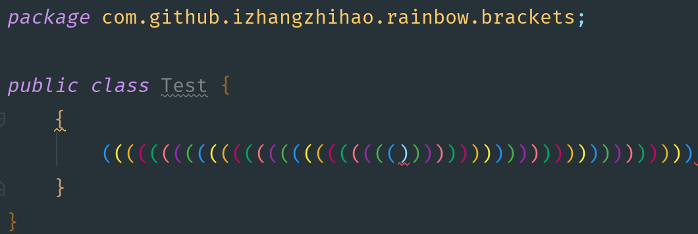
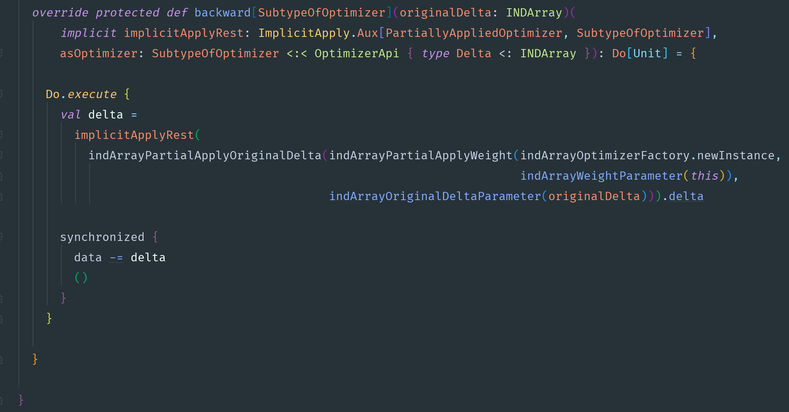
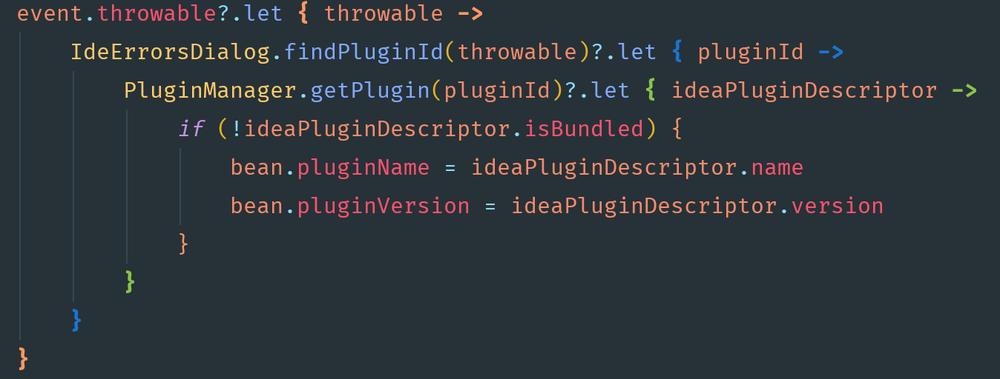
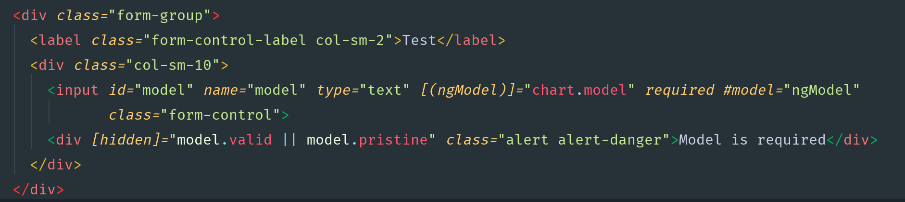

# Rainbow Brackets    

## Rainbow Brackets / Rainbow Parentheses for IntelliJ IDEA-based IDEs

## Compatible with

IntelliJ IDEA, PhpStorm, WebStorm, PyCharm, RubyMine, AppCode, CLion, Gogland, DataGrip, Rider, MPS, Android Studio

## Supported languages

Java, Scala, Clojure, Kotlin, Python, Haskell, Agda, Rust, JavaScript, TypeScript, Erlang, Go, Groovy, Ruby, Elixir, ObjectiveC, PHP, C#, HTML, XML, SQL, Apex language ...

## This plugin is also compatible with [material-theme-jetbrains-eap](https://github.com/mallowigi/material-theme-jetbrains-eap)

## Screenshots

* with material-theme-jetbrains-eap

* with scala

* with kotlin

* with HTML/XML

* and more...

## Install

https://plugins.jetbrains.com/plugin/10080-rainbow-brackets

## Contribute

* `gradle runIde`
* `gradle buildPlugin`

## Acknowledgements

Intellij-rainbow-brackets is heavily inspired by [intellij-rainbow](https://github.com/zjhmale/intellij-rainbow) and [Rainbow Brackets for Visual Studio Code](https://marketplace.visualstudio.com/items?itemName=2gua.rainbow-brackets)
