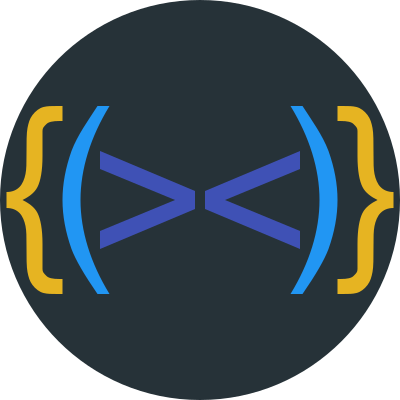

<div align="center">
    <a href="https://plugins.jetbrains.com/plugin/10080-rainbow-brackets">
        
    </a>
</div>
<h1 align="center">Intellij rainbow brackets</h1>
<p align="center">🌈Rainbow Brackets for IntelliJ-based IDEs/Android Studio/HUAWEI DevEco Studio And <a href="https://github.com/izhangzhihao/intellij-rainbow-brackets/blob/2022.3/Fleet.md">Fleet</p>

<p align="center">
<a href="https://plugins.jetbrains.com/plugin/10080-rainbow-brackets"></a>
<a href="https://plugins.jetbrains.com/embeddable/install/10080"></a>
<a href="https://plugins.jetbrains.com/plugin/10080-rainbow-brackets"></a>
<a href="https://opencollective.com/intellij-rainbow-brackets#backer"></a>
<a href="https://opencollective.com/intellij-rainbow-brackets#sponsor"></a>
</p>

<br>

# Table of contents

- [Change log](https://github.com/izhangzhihao/intellij-rainbow-brackets/blob/2022.3/CHANGELOG.md#change-log)
- [Fleet Support](https://github.com/izhangzhihao/intellij-rainbow-brackets/blob/2022.3/Fleet.md)
- [Core Features](#core-features)
- [Compatibility](#compatibility)
- [Supported languages](#supported-languages)
- [Install](#install)
- [Screenshots](#screenshots)
- [Config file path](#config-file-path)
- [Rainbow Brackets Lite](#rainbow-brackets-lite)

## Core features

<li><a href="https://github.com/izhangzhihao/intellij-rainbow-brackets#java">Rainbowify various types brackets(Round,Squiggly,Square,Angle)</a></li>
        <li><a href="https://www.youtube.com/watch?v=8WRH59PQ5Dk">Rainbowify variables for more languages & config colors using color generator </a></li>
        <li><a href="https://github.com/izhangzhihao/intellij-rainbow-brackets#indent-highlighting">Rainbowify indent guidelines</a></li>
        <li><a href="https://github.com/izhangzhihao/intellij-rainbow-brackets#scope-highlighting">Scope highlighting</a></li>
        <li><a href="https://github.com/izhangzhihao/intellij-rainbow-brackets#htmlxml">Rainbowify tag name for XML/HTML</a></li>
        <li><a href="https://github.com/izhangzhihao/intellij-rainbow-brackets#yaml">Rainbowify property name for YAML/JSON</a></li>
        <li><a href="https://github.com/izhangzhihao/intellij-rainbow-brackets#customize-colors">Customize colors</a></li>
        <li><a href="https://github.com/izhangzhihao/intellij-rainbow-brackets#use-the-color-generator">Color generator</a></li>
        <li><a href="https://github.com/izhangzhihao/intellij-rainbow-brackets#javascript--typescript">JSX support</a></li>
        <li><a href="https://github.com/izhangzhihao/intellij-rainbow-brackets#python">Rainbowify Python keywords & indent guidelines</a></li>
        <li><a href="https://github.com/izhangzhihao/intellij-rainbow-brackets/discussions/2643">Scope highlighting for Python</a></li>
        <li><a href="https://github.com/izhangzhihao/intellij-rainbow-brackets/discussions/2644">Current Block Highlighting</a></li>
        <li><a href="https://github.com/izhangzhihao/intellij-rainbow-brackets#disable-rainbow-brackets-for-specific-languages">Block list support</a></li>
        <br/>

## Compatibility

IntelliJ IDEA(Ultimate/Community/Educational), PhpStorm, WebStorm, PyCharm(Professional/Community/Educational), RubyMine, AppCode, CLion, CLion(Nova), Gogland, DataGrip, Rider, MPS, Android Studio, HUAWEI DevEco Studio, DataSpell, Code With Me(Host), RustRover, Aqua

## Supported languages

Java, Scala, Clojure, Kotlin, Python, Haskell, Agda, Rust, JavaScript, TypeScript, Erlang, Go, Groovy, Ruby, Elixir, Objective-C, PHP, HTML, XML, SQL, Apex language, C#, F#, Dart, Pug/Jade, Bash, Vue.js, C# Razor Pages, GLSL(the OpenGL Shading Language), Go Template, C++, C, Solidity, Jinja2, Clang, CPP, C...

## Install

<a href="https://plugins.jetbrains.com/embeddable/install/10080">
    
</a>

### Install it inside your IDE:

For Windows & Linux - <kbd>File</kbd> > <kbd>Settings</kbd> > <kbd>Plugins</kbd> > <kbd>Marketplace</kbd> > <kbd>Search for "Rainbow Brackets"</kbd> > <kbd>Install Plugin</kbd> > <kbd>Restart IntelliJ IDEA</kbd>

For Mac - <kbd>IntelliJ IDEA</kbd> > <kbd>Preferences</kbd> > <kbd>Plugins</kbd> > <kbd>Marketplace</kbd> > <kbd>Search for "Rainbow Brackets"</kbd> > <kbd>Install Plugin</kbd>  > <kbd>Restart IntelliJ IDEA</kbd>

### Download the [latest release](https://github.com/izhangzhihao/intellij-rainbow-brackets/releases/latest) and install it manually using
  <kbd>Settings/Preferences</kbd> > <kbd>Plugins</kbd> > <kbd>⚙️</kbd> > <kbd>Install plugin from disk...</kbd>

## Screenshots

### Java


### Scala


### Clojure


### Kotlin


### HTML/XML

**NOTE: need to turn on the 'Rainbowify tag name' option**


### Javascript & Typescript

**NOTE: need to turn on the 'Rainbowify tag name' option**


### C#


### Dart


### Python


### Pug/Jade


### YAML

To disable rainbowify tags for yaml, please follow: https://github.com/izhangzhihao/intellij-rainbow-brackets/discussions/2639#discussioncomment-6106439


### Indent highlighting

options:


* Focus mode


* Only selected indent guide(free)

highlighting indent guideline only when you select this indent line


* Only current indent guide

highlighting indent guide lines for current lines


* All indent guide related

highlighting **all** indent guide lines for current lines


### Scope highlighting

**The highlight effects will not remove after releasing the shortcuts, but press the `ESC` key can do this. You could also config `Press any key to remove the highlighting effect` on the setting page.**

<kbd>Ctrl + Button3</kbd>(Windows & Linux) or <kbd>Meta + Button3</kbd>(Mac):

NOTE: <kbd>Button3</kbd> means "Secondary Click (click or tap with two fingers)" on Mac os, "Right click" for Windows or Linux.
NOTE: <kbd>Meta</kbd> means <kbd>command</kbd> on Mac os.


<kbd>Alt + Button3</kbd>(Windows & Linux) or <kbd>option + Button3</kbd>(Mac):

NOTE: <kbd>Button3</kbd> means "Secondary Click (click or tap with two fingers)" on Mac os, "Right click" for Windows or Linux.


### looking forward to your screenshots(PR welcome!)

## Customize colors

<kbd>Settings/Preferences</kbd> > <kbd>Editor</kbd> > <kbd>Color Scheme</kbd> > <kbd>Rainbow Brackets</kbd>:


## Config the number of colors?

<kbd>Settings/Preferences</kbd> > <kbd>Other Settings</kbd> > <kbd>Rainbow Brackets</kbd> > <kbd>Color</kbd> > `Number of colors`: 5 or more

And you can use the color generator and configure your number of colors at the same time.

NOTE: For the default and Darcula color scheme(`Editor -> Color Scheme -> Rainbow Brackets -> Scheme`) the color number is 10, for the other scheme the number is 5, if your number is bigger than the number, you can config them in the config file.
If the color does not exist, we will use the color generator to generate it for you.

## Use the color generator

If you didn't like the built-in colors or want some new colors but don't want to try out and pick colors. Please use the color generator.

<kbd>Settings/Preferences</kbd> > <kbd>Rainbow Brackets</kbd> > <kbd>Color</kbd> > <kbd>Use color generator</kbd>

If you turn on this option, we will auto-generate some colors for you.

### Advanced options for color generator


```hue``` – Controls the hue of the generated color. You can pass a string representing a color name: ```red```, ```orange```, ```yellow```, ```green```, ```blue```, ```purple```, ```pink``` and ```monochrome``` are currently supported. If you pass a  hexidecimal color string such as ```#00FFFF```, the color generator will extract its hue value and use that to generate colors.

```luminosity``` – Controls the luminosity of the generated color. You can specify a string containing ```bright```, ```light``` or ```dark```.

## Config file path

If you want to customize the advanced configuration, you could edit the config file and then restart your IDE. 
The config file path is in `APP_CONFIG/rainbow_brackets.xml`. 

In MAC OS env maybe like `~/Library/Preferences/IntelliJIdea2020.2/options/rainbow_brackets.xml`.

If you are using the ToolBox, then it will be like `~/Library/ApplicationSupport/JetBrains/IntelliJIdea2020.2/options/rainbow_brackets.xml`

In Linux env maybe like `~/.IntelliJIdea/config/options/rainbow_brackets.xml`.

In Windows env maybe like `C:\Users\izhangzhihao\.IntelliJIdea2020.2\config\options\rainbow_brackets.xml`.

## JSX support

To enable rainbow brackets for JSX like this:

```javascript
var html = '<div><div><div>Hello</div></div></div>';
```

This plugin will automatically override color scheme property "HTML_CODE" [cause our rainbow color been covered by intellij built-in functionality](https://intellij-support.jetbrains.com/hc/en-us/community/posts/360000117450-My-HighlightVisitor-been-covered-by-intellij-built-in-functionality).
You still could set <kbd>Settings/Preferences</kbd> > <kbd>Other Settings</kbd> > <kbd>Rainbow Brackets</kbd> > <kbd>Language Specific</kbd> > <kbd>Rainbowify JSX</kbd> in the config file to disable.

## Kotlin function literal braces and arrow

To enable rainbow brackets for multiple-level lambda Kotlin code like this:

```kotlin
event.throwable?.let { throwable ->
    IdeErrorsDialog.findPluginId(throwable)?.let { pluginId ->
        PluginManager.getPlugin(pluginId)?.let { ideaPluginDescriptor ->
            if (!ideaPluginDescriptor.isBundled) {
                bean.pluginName = ideaPluginDescriptor.name
                bean.pluginVersion = ideaPluginDescriptor.version
            }
        }
    }
}
```

This plugin will automatically override the color scheme property "KOTLIN_FUNCTION_LITERAL_BRACES_AND_ARROW" cause our rainbow color is being covered by the Kotlin plugin's built-in functionality.
You still could set <kbd>Settings/Preferences</kbd> > <kbd>Other Settings</kbd> > <kbd>Rainbow Brackets</kbd> > <kbd>Language Specific</kbd> > <kbd>Rainbowify Kotlin function literal braces and arrow</kbd> in the config page to disable.

## Disable rainbow brackets for specific languages

<kbd>Settings/Preferences</kbd> > <kbd>Other Settings</kbd> > <kbd>Rainbow Brackets</kbd> > `Do NOT rainbowify these languages (name or extension, comma separated)`: 

NOTE: You can use **name** of language or **extension** of file name(The names should be **lowercase**).

## Support Us

You can support us by the following actions:

* Buy a license [here](https://plugins.jetbrains.com/plugin/10080-rainbow-brackets/pricing#tabs)
* Star this project
* Share this plugin with your friends
* Rate this plugin on [JetBrains plugin repository](https://plugins.jetbrains.com/plugin/10080-rainbow-brackets)
* Make pull requests
* Report bugs
* Tell us your ideas
* Become a sponsor by donating on [Open Collective](https://opencollective.com/intellij-rainbow-brackets)
* Become a sponsor by donating with AliPay or WeChatPay
* Don't want to use Alipay's mobile App? If you could read Chinese, please use [the official website](https://shenghuo.alipay.com/send/payment/fill.htm) to transfer your donation to my Alipay account(izhangzhihao@hotmail.com). Otherwise, you can try [the English version of Alipay](https://global.alipay.com/) to transfer your donation.

<table>
  <tr>
    <th width="25%">JetBrains MarketPlace</th>
    <th width="25%">Open Collective</th>
    <th width="25%">AliPay</th>
    <th width="25%">WeChatPay</th>
  </tr>
  <tr></tr>
  <tr align="center">
    <td>
        <a href="https://plugins.jetbrains.com/plugin/10080-rainbow-brackets/pricing#tabs" target="_blank">
            
        </a>
    </td>
    <td>
        <a href="https://opencollective.com/intellij-rainbow-brackets" target="_blank">
            
        </a>
    </td>
    <td></td>
    <td></td>
  </tr>
</table>

## Backers

Thank you to all our backers! ❤️ [[Become a backer](https://opencollective.com/intellij-rainbow-brackets#backer)]

<a href="https://opencollective.com/intellij-rainbow-brackets#backers" target="_blank"></a>

## Sponsors

Support this project by becoming a sponsor! 🌈 Your logo will show up here with a link to your website. [[Become a sponsor](https://opencollective.com/intellij-rainbow-brackets#sponsor)]

<a href="https://opencollective.com/intellij-rainbow-brackets/sponsor/0/website" target="_blank"></a>
<a href="https://opencollective.com/intellij-rainbow-brackets/sponsor/1/website" target="_blank"></a>
<a href="https://opencollective.com/intellij-rainbow-brackets/sponsor/2/website" target="_blank"></a>
<a href="https://opencollective.com/intellij-rainbow-brackets/sponsor/3/website" target="_blank"></a>
<a href="https://opencollective.com/intellij-rainbow-brackets/sponsor/4/website" target="_blank"></a>
<a href="https://opencollective.com/intellij-rainbow-brackets/sponsor/5/website" target="_blank"></a>
<a href="https://opencollective.com/intellij-rainbow-brackets/sponsor/6/website" target="_blank"></a>
<a href="https://opencollective.com/intellij-rainbow-brackets/sponsor/7/website" target="_blank"></a>
<a href="https://opencollective.com/intellij-rainbow-brackets/sponsor/8/website" target="_blank"></a>
<a href="https://opencollective.com/intellij-rainbow-brackets/sponsor/9/website" target="_blank"></a>
<a href="https://opencollective.com/intellij-rainbow-brackets/sponsor/10/website" target="_blank"></a>
<a href="https://opencollective.com/intellij-rainbow-brackets/sponsor/11/website" target="_blank"></a>
<a href="https://opencollective.com/intellij-rainbow-brackets/sponsor/12/website" target="_blank"></a>
<a href="https://opencollective.com/intellij-rainbow-brackets/sponsor/13/website" target="_blank"></a>
<a href="https://opencollective.com/intellij-rainbow-brackets/sponsor/14/website" target="_blank"></a>
<a href="https://opencollective.com/intellij-rainbow-brackets/sponsor/15/website" target="_blank"></a>

## Rainbow Brackets Lite

This repo is used to compile a fully free version of our product for the community to use. This is because some users do not need the paid features and do not want to constantly update their software. An open-source, entirely free, and stable version is a good option for these users.

I believe this will benefit both the community and our team. The community will have access to a free version of our software, and our team will continue to receive support from those who appreciate and value the paid features.

Please download the Lite version [here](https://plugins.jetbrains.com/plugin/20710).

**NOTE: the lite version does NOT support C# lang and NOT support C++ in the Rider IDE**

## Acknowledgements

Intellij-rainbow-brackets is heavily inspired by [Rainbow Brackets for Visual Studio Code](https://marketplace.visualstudio.com/items?itemName=2gua.rainbow-brackets)
